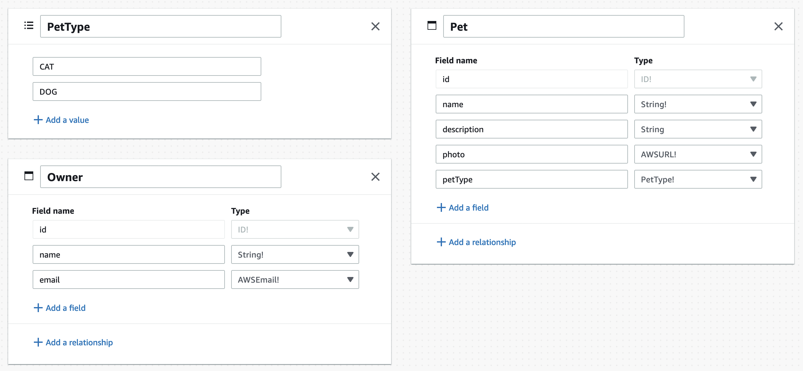

# AWS Summit - Amplify App

## Data Modeling

### Create Data Model

Access the Amplify Sandbox at [https://sandbox.amplifyapp.com/](https://sandbox.amplifyapp.com/) to ceate your data model.



### Create a React app

```shell
npx create-react-app@latest adopt-a-pet
cd adopt-a-pet
```

### Install Amplify CLI

```shell
curl -sL https://aws-amplify.github.io/amplify-cli/install | bash && $SHELL
```

### Pull from Sandbox

```shell
amplify pull --sandboxId <sandboxId>
```

Amplify created a GraphQL schema for our data model at `amplify/backend/api/amplifyDatasource/schema.graphql`:

```graphql
type Owner @model @auth(rules: [{allow: public}]) {
  id: ID!
  name: String!
  email: AWSEmail!
}

enum PetType {
  CAT
  DOG
}

type Pet @model @auth(rules: [{allow: public}]) {
  id: ID!
  name: String!
  description: String
  photo: AWSURL!
  petType: PetType!
  owner: Owner @hasOne
}
```

## Test Locally

### Create new Pet

Modify `src/App.js` to create a new Pet:

```javascript
import { DataStore } from '@aws-amplify/datastore';
import { Pet, PetType } from './models';

function App() {

  const addPet = async() => {
    const newPet = await DataStore.save(new Pet({
      "name": prompt('Name'),
      "photo": prompt('Photo'),
      "petType": PetType.DOG,
    }));

    console.log(newPet);
  }

  return (
    <div className="App">
      <button onClick={addPet}>Add Pet</button>
    </div>
  );
}

export default App;
```

### List Pets

We will use React's [`useEffect`](https://reactjs.org/docs/hooks-effect.html) to fetch Pets when loading the App:

```javascript
import { DataStore } from '@aws-amplify/datastore';
import { useEffect } from 'react';
import { Pet, PetType } from './models';

function App() {

  useEffect(() => {
    const getPets = async() => {
      const models = await DataStore.query(Pet);
      console.log(models);
    }

    getPets()
  }, []);

  ...
}

export default App;
```

## Deploy

## Content

## User Interface

```shell
npm install @aws-amplify/ui-react
```

Configure Amplify on `src/index.js`:

```javascript
import Amplify from 'aws-amplify';
import "@aws-amplify/ui-react/styles.css";
import {AmplifyProvider} from "@aws-amplify/ui-react";
import awsconfig from './aws-exports';

Amplify.configure(awsconfig);
```

## Authentication
